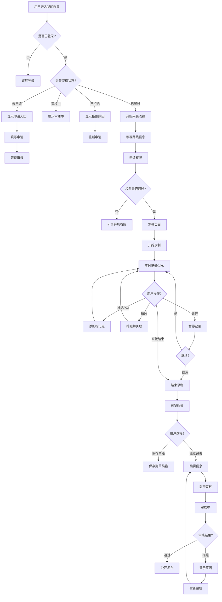
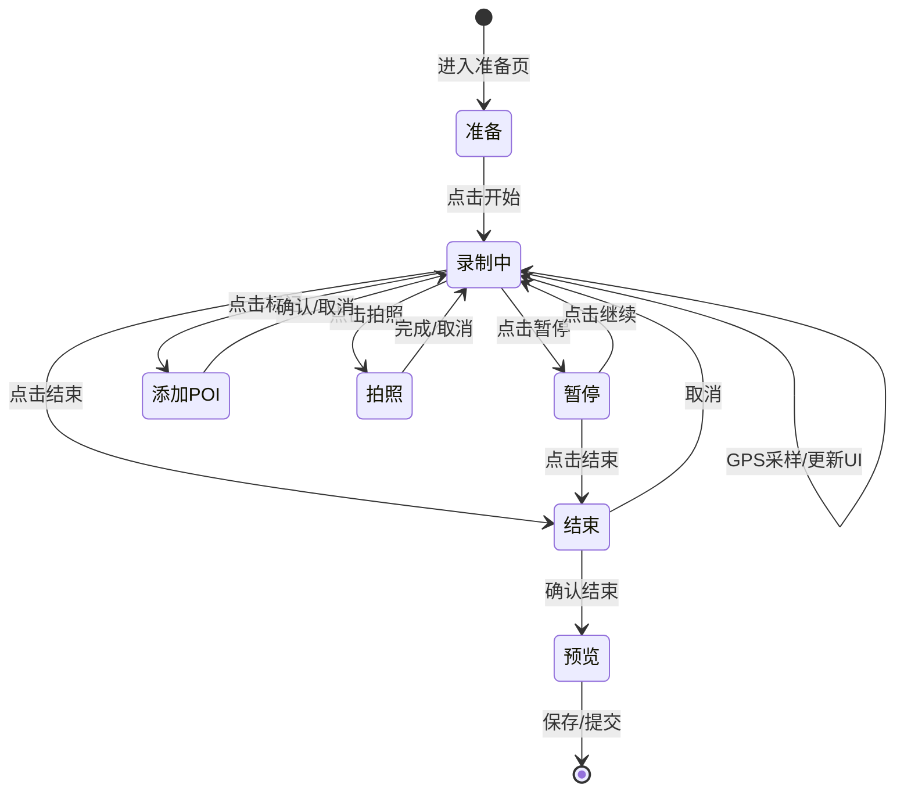
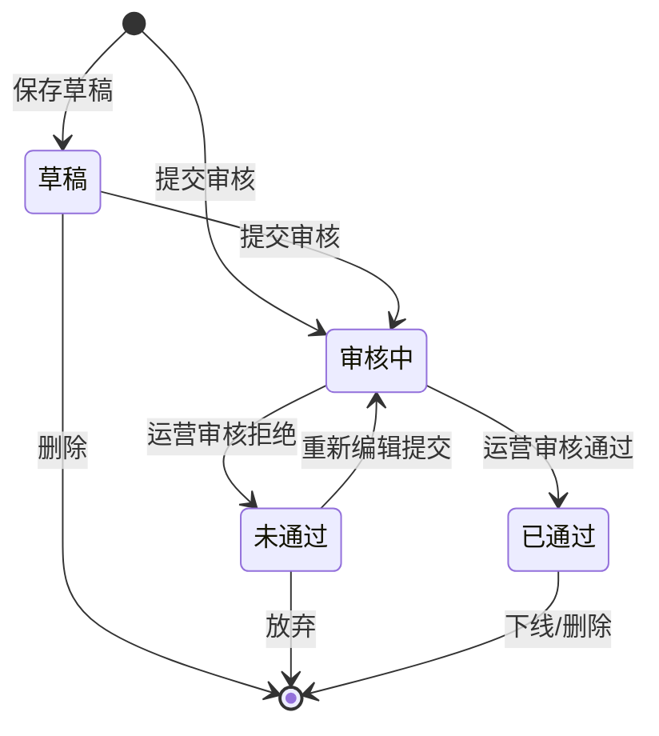

# 轨迹采集功能 PRD

> **版本**: v1.0  
> **创建时间**: 2026-03-20  
> **参考产品**: 两步路、Strava、Keep路线、AllTrails  

---

## 1. 需求概述

### 1.1 背景
为平台用户提供路线数据采集能力，让用户能够记录自己的户外轨迹、标记POI、上传照片，形成可分享的路线内容。

### 1.2 决策结论

| 决策项 | 结论 |
|--------|------|
| 权限控制 | 所有用户可申请，资格验证后续实现 |
| 发布审核 | 必须运营审核后发布 |
| 后台保活 | 前台优先（用户需保持App前台运行） |
| 采集执行 | 用户亲自采集（禁止代采/导入） |

### 1.3 目标用户
- 户外爱好者：徒步、登山、骑行、跑步用户
- 内容贡献者：愿意为社区分享优质路线的KOC
- 新手向导：希望记录并分享自己熟悉路线的基础用户

---

## 2. 功能架构

```
┌─────────────────────────────────────────────────────────────────┐
│                        轨迹采集功能                              │
├──────────────┬──────────────┬──────────────┬──────────────────────┤
│   功能入口    │   录制流程    │   录制后     │     审核管理         │
├──────────────┼──────────────┼──────────────┼──────────────────────┤
│ • 我的页面    │ • 信息预填    │ • 轨迹预览   │ • 采集记录列表       │
│   采集入口    │ • 权限申请    │ • 数据编辑   │ • 审核状态跟踪       │
│ • 权限控制    │ • 实时录制    │ • 提交审核   │ • 重新编辑           │
│ • 首次引导    │ • POI标记    │ • 草稿保存   │ • 拒绝原因查看       │
└──────────────┴──────────────┴──────────────┴──────────────────────┘
```

---

## 3. 功能入口设计

### 3.1 入口位置

**主入口：我的页面 - 我的采集**

```
┌──────────────────────────────┐
│           我的页面            │
├──────────────────────────────┤
│ 头像  用户名                  │
│         编辑资料              │
├──────────────────────────────┤
│ ○ 我的动态  ○ 我的收藏        │
│ ○ 我的采集 [NEW] ○ 设置      │
├──────────────────────────────┤
│                              │
│    ┌──────────────────┐      │
│    │  🎯 开始采集     │      │
│    │  记录你的第一条  │      │
│    │  户外路线       │      │
│    └──────────────────┘      │
│                              │
└──────────────────────────────┘
```

**理由：**
- 采集是"我的"内容生产行为，与"我的动态"、"我的收藏"逻辑一致
- 避免与发现页UGC发布（+号按钮）混淆
- 采集需要持续占用设备，是重度功能，不宜放在一级Tab

### 3.2 入口权限控制

| 用户状态 | 展示逻辑 | 点击行为 |
|----------|----------|----------|
| 未登录 | 显示入口，带锁图标 | 跳转登录页 |
| 已登录，未申请 | 显示入口，显示"申请采集资格" | 跳转申请页 |
| 已登录，审核中 | 显示入口，显示"审核中" | Toast提示"审核中，请耐心等待" |
| 已登录，已通过 | 正常显示入口 | 进入采集流程 |
| 已登录，已拒绝 | 显示入口，显示"重新申请" | 跳转申请页，显示拒绝原因 |

### 3.3 首次使用引导流程

**引导页 1：功能介绍**
```
┌──────────────────────────────┐
│                              │
│         [轨迹动画]            │
│                              │
│      记录你的户外路线         │
│                              │
│   GPS精准记录轨迹，自动统计   │
│   距离、海拔、速度等数据      │
│                              │
│         [开始体验]            │
│                              │
└──────────────────────────────┘
```

**引导页 2：POI标记**
```
┌──────────────────────────────┐
│                              │
│         [POI标记动画]         │
│                              │
│      标记精彩打卡点           │
│                              │
│   沿途标记景点、危险点、      │
│   补给点等，帮助他人更好地    │
│   规划路线                    │
│                              │
│         [下一步]              │
│                              │
└──────────────────────────────┘
```

**引导页 3：审核说明**
```
┌──────────────────────────────┐
│                              │
│         [审核图示]            │
│                              │
│      审核后发布               │
│                              │
│   采集完成后提交审核，         │
│   通过后即可被其他用户发现     │
│                              │
│         [我知道了]            │
│                              │
└──────────────────────────────┘
```

---

## 4. 录制前流程

### 4.1 路线信息预填写

```
┌──────────────────────────────┐
│ < 新建采集           下一步  │
├──────────────────────────────┤
│                              │
│ 路线名称 *                   │
│ ┌──────────────────────────┐ │
│ │ 例如：西湖环湖徒步路线    │ │
│ └──────────────────────────┘ │
│                              │
│ 所在城市 *                   │
│ ┌──────────────────────────┐ │
│ │ 点击选择城市 ▼           │ │
│ └──────────────────────────┘ │
│                              │
│ 路线类型 *                   │
│ ┌──────┐ ┌──────┐ ┌──────┐  │
│ │ 徒步 │ │ 登山 │ │ 骑行 │  │
│ └──────┘ └──────┘ └──────┘  │
│ ┌──────┐ ┌──────┐            │
│ │ 跑步 │ │ 自驾 │            │
│ └──────┘ └──────┘            │
│                              │
│ 难度预估                     │
│ ☆ ☆ ☆ ☆ ☆ (点击选择)        │
│ 简单 <────────────> 困难     │
│                              │
│ 预计用时                     │
│ ┌──────────────────────────┐ │
│ │ 2小时30分钟              │ │
│ └──────────────────────────┘ │
│                              │
└──────────────────────────────┘
```

**字段说明：**

| 字段 | 必填 | 说明 |
|------|------|------|
| 路线名称 | 是 | 2-30字，不可与已有公开路线重复 |
| 所在城市 | 是 | 定位自动填充，可修改 |
| 路线类型 | 是 | 单选：徒步/登山/骑行/跑步/自驾 |
| 难度预估 | 否 | 1-5星，仅作参考 |
| 预计用时 | 否 | 辅助判断，可不填 |

### 4.2 权限申请

**顺序申请，拒绝则弹窗说明：**

```
┌──────────────────────────────┐
│                              │
│         [定位图标]            │
│                              │
│      需要定位权限             │
│                              │
│   轨迹采集需要持续获取您的    │
│   位置信息以记录运动轨迹      │
│                              │
│   ┌──────────────────────┐   │
│   │     允许定位         │   │
│   └──────────────────────┘   │
│                              │
│   [暂不开启]                 │
│                              │
└──────────────────────────────┘
```

**权限清单：**

| 权限 | 用途 | 拒绝后果 |
|------|------|----------|
| 定位（始终） | 记录GPS轨迹点 | 无法使用功能 |
| 相机 | 拍摄POI照片 | 可继续使用，但无法拍照 |
| 存储/相册 | 保存轨迹数据、选图 | 可继续使用，但无法上传本地照片 |
| 通知 | 录制状态提醒 | 可继续使用，但切换应用时无提醒 |

**iOS后台定位特殊处理：**
```
系统弹窗后，如用户选择"仅使用时允许"：
→ 提示："轨迹采集需要始终定位权限，请前往设置开启"
→ 提供[去设置]按钮
```

### 4.3 开始录制确认

```
┌──────────────────────────────┐
│         准备开始              │
├──────────────────────────────┤
│                              │
│  📍 GPS信号  [████████░░] 强 │
│                              │
│  🔋 电量     [██████░░░░] 65%│
│                              │
│  💾 存储空间  可用 12.5 GB   │
│                              │
│  ─────────────────────────  │
│                              │
│  采集提示：                   │
│  • 请保持App在前台运行        │
│  • 建议开启省电模式           │
│  • 开始后将锁定屏幕方向       │
│                              │
│   ┌──────────────────────┐   │
│   │    🎬 开始录制       │   │
│   └──────────────────────┘   │
│                              │
└──────────────────────────────┘
```

**状态判断：**

| 状态 | GPS信号 | 电量 | 建议 |
|------|---------|------|------|
| 良好 | >4颗星 | >30% | 可直接开始 |
| 一般 | 2-4颗星 | 15-30% | 提示携带充电宝 |
| 差 | <2颗星 | <15% | 建议改善后再开始 |

---

## 5. 录制中功能规格

### 5.1 录制页面布局

```
┌──────────────────────────────┐
│ ○ 信号  ● REC  00:23:15  🔋  │
├──────────────────────────────┤
│                              │
│      ┌────────────────┐      │
│      │                │      │
│      │   轨迹地图      │      │
│      │   (实时绘制)    │      │
│      │                │      │
│      └────────────────┘      │
│                              │
│  ┌────────────────────────┐  │
│  │  2.35 km    │    45 min │  │
│  │  ───────────┼───────────│  │
│  │  128 m      │    4.2km/h│  │
│  │  累计爬升    │   均速    │  │
│  └────────────────────────┘  │
│                              │
│  ┌────┐ ┌────┐ ┌────┐ ┌────┐│
│  │📍  │ │📷  │ │⏸️  │ │⏹️  ││
│  │标记│ │拍照│ │暂停│ │结束││
│  └────┘ └────┘ └────┘ └────┘│
│                              │
└──────────────────────────────┘
```

### 5.2 实时数据显示

| 数据项 | 显示规则 | 数据来源 |
|--------|----------|----------|
| 距离 | 实时累加，精确到0.01km | GPS坐标计算 |
| 时长 | 正计时 HH:MM:SS | 系统时间 |
| 累计爬升 | 海拔上升累加，精确到1m | GPS海拔或气压计 |
| 当前海拔 | 实时显示，精确到1m | GPS海拔 |
| 当前速度 | 实时更新，精确到0.1km/h | GPS瞬时速度 |
| 均速 | 总距离/总时长 | 计算值 |

**数据显示异常处理：**
```
GPS信号弱：
→ 数据区显示"--"
→ 地图轨迹暂停绘制
→ Toast："GPS信号较弱，请走到开阔地带"

海拔数据异常（突变>100m）：
→ 使用平滑算法过滤
→ 标记疑似异常点，后台校准
```

### 5.3 POI标记功能

**触发时机：**
- 用户主动点击标记按钮
- 系统检测到停留（>5分钟在同一位置，半径<50m）

**POI类型选择：**
```
┌──────────────────────────────┐
│      添加标记点        ✕     │
├──────────────────────────────┤
│                              │
│ 选择类型：                    │
│                              │
│  ┌────┐ ┌────┐ ┌────┐ ┌────┐│
│  │🏔️  │ │📸  │ │⚠️  │ │🚰  ││
│  │景点│ │打卡│ │危险│ │补给││
│  └────┘ └────┘ └────┘ └────┘│
│  ┌────┐ ┌────┐ ┌────┐ ┌────┐│
│  │🏕️  │ │🅿️  │ │🍜  │ │🚻  ││
│  │营地│ │停车│ │餐饮│ │厕所││
│  └────┘ └────┘ └────┘ └────┘│
│  ┌────┐ ┌────┐               │
│  │🌄  │ │⛰️  │               │
│  │观景点│ │ summit │          │
│  └────┘ └────┘               │
│                              │
│  ┌────────────────────────┐  │
│  │ 📝 添加描述（可选）    │  │
│  └────────────────────────┘  │
│                              │
│  ┌────────────────────────┐  │
│  │        确认添加        │  │
│  └────────────────────────┘  │
│                              │
└──────────────────────────────┘
```

**POI数据结构：**
```json
{
  "id": "poi_uuid",
  "type": "scenic|checkpoint|warning|water|campsite|parking|food|toilet|viewpoint|summit",
  "latitude": 30.123456,
  "longitude": 120.123456,
  "altitude": 150.5,
  "timestamp": 1710931200000,
  "description": "用户输入的描述",
  "photos": ["photo_url_1", "photo_url_2"]
}
```

### 5.4 拍照关联逻辑

**拍照入口：**
- 点击拍照按钮 → 唤起系统相机
- 拍照后自动关联到当前位置

**照片类型：**
| 类型 | 触发方式 | 用途 |
|------|----------|------|
| POI照片 | 添加POI时拍摄/选择 | 作为POI配图 |
| 轨迹照片 | 独立点击拍照 | 仅记录位置，不创建POI |

**照片处理：**
- 压缩：最大1080px宽，JPEG 80%质量
- 元数据：写入GPS坐标、拍摄时间
- 存储：先存本地，提交时上传

### 5.5 暂停/继续/结束控制

**暂停状态：**
```
┌──────────────────────────────┐
│ ○ 信号  ⏸ 暂停  00:23:15  🔋 │
├──────────────────────────────┤
│                              │
│         [轨迹地图]            │
│      轨迹以虚线显示暂停段      │
│                              │
│   ┌──────────────────────┐   │
│   │     ▶ 继续录制       │   │
│   └──────────────────────┘   │
│                              │
│   ┌──────────────────────┐   │
│   │     ⏹ 结束录制       │   │
│   └──────────────────────┘   │
│                              │
└──────────────────────────────┘
```

**暂停规则：**
- 暂停时：停止记录GPS点，停止计时
- 暂停期间：可查看地图、添加POI（时间戳为暂停开始时间）
- 继续时：恢复记录，暂停段轨迹以虚线区分

**结束确认：**
```
┌──────────────────────────────┐
│                              │
│      确认结束录制？           │
│                              │
│   当前进度：                  │
│   距离：5.2 km               │
│   用时：1小时23分            │
│   POI：3个                   │
│   照片：12张                 │
│                              │
│   [取消]        [确认结束]   │
│                              │
└──────────────────────────────┘
```

### 5.6 异常处理

**GPS信号弱：**
```
检测逻辑：连续30秒定位精度 > 50m 或 卫星数 < 4

处理：
1. 顶部状态栏变红，显示"GPS信号弱"
2. 数据区显示"--"
3. Toast提示："GPS信号较弱，请走到开阔地带"
4. 继续尝试定位，恢复后自动继续记录
5. 信号弱期间记录的轨迹点标记为"low_accuracy"
```

**电量低：**
```
检测逻辑：电量 < 20%

处理：
1. 弹窗提示："电量低于20%，建议连接充电宝或尽快结束录制"
2. 提供[结束录制]快捷按钮
3. 如电量 < 10%，弹窗变为强提醒，增加震动

省电模式（用户可选）：
- 降低GPS采样频率（1秒→5秒）
- 关闭地图实时渲染，仅保留轨迹线
- 息屏后继续记录（依赖系统后台定位）
```

**App被切换到后台：**
```
处理：
1. 发送通知："正在录制轨迹，点击返回App"
2. 依赖系统后台定位继续记录（iOS需始终权限）
3. 如系统终止App，下次打开时提示："上次录制异常终止，是否恢复？"

恢复逻辑：
- 检查本地未完成的录制缓存
- 如<24小时，提供恢复选项
- 恢复后从终止点继续绘制轨迹
```

**存储空间不足：**
```
检测逻辑：可用空间 < 500MB

处理：
1. 弹窗警告："存储空间不足，可能无法保存照片"
2. 提供[结束录制]和[继续]选项
3. 如空间 < 100MB，强制结束并保存已录数据
```

---

## 6. 录制后流程

### 6.1 数据预览

```
┌──────────────────────────────┐
│ < 预览              下一步  │
├──────────────────────────────┤
│                              │
│      ┌────────────────┐      │
│      │                │      │
│      │   轨迹回放      │      │
│      │   (可播放动画)  │      │
│      │                │      │
│      └────────────────┘      │
│                              │
│  ┌────────────────────────┐  │
│  │ 📊 数据统计            │  │
│  │ 距离: 5.2km  用时: 1:23 │  │
│  │ 爬升: 285m  最高: 420m  │  │
│  └────────────────────────┘  │
│                              │
│  ┌────────────────────────┐  │
│  │ 📍 标记点 (3)          │  │
│  │ • 起点 - 09:30         │  │
│  │ • 观景台 - 10:15 📷    │  │
│  │ • 补给点 - 11:00       │  │
│  │ • 终点 - 11:53         │  │
│  └────────────────────────┘  │
│                              │
└──────────────────────────────┘
```

**轨迹回放功能：**
- 播放按钮：按时间轴回放轨迹绘制过程
- 进度条：可拖动查看任意时刻位置
- 倍速：1x / 2x / 4x

### 6.2 信息补充

```
┌──────────────────────────────┐
│ < 完善信息          提交审核 │
├──────────────────────────────┤
│                              │
│ 封面图 *                     │
│ ┌────┐ ┌────┐ ┌────┐ ┌────┐ │
│ │ 📷 │ │    │ │    │ │ +  │ │
│ │建议│ │备选│ │备选│ │更多│ │
│ └────┘ └────┘ └────┘ └────┘ │
│ （系统推荐最佳封面，可更换）  │
│                              │
│ 路线描述 *                   │
│ ┌──────────────────────────┐ │
│ │ 介绍路线特色、注意事项、   │ │
│ │ 适合人群等...             │ │
│ │                          │ │
│ │                          │ │
│ └──────────────────────────┘ │
│                              │
│ 标签（选填）                  │
│ ┌──────────────────────────┐ │
│ │ 亲子友好 新手入门 风景优美 │ │
│ │ 有挑战性 环线 宠物友好    │ │
│ └──────────────────────────┘ │
│ 推荐季节                     │
│ ○ 春季 ○ 夏季 ○ 秋季 ○ 冬季 │
│                              │
│ 最佳时间                     │
│ ┌──────────────────────────┐ │
│ │ 如：清晨看日出、傍晚看夕阳 │ │
│ └──────────────────────────┘ │
│                              │
└──────────────────────────────┘
```

**必填字段：**
- 封面图：从拍摄照片中选择1张
- 路线描述：50-500字

**选填字段：**
- 标签：多选，最多5个
- 推荐季节：多选
- 最佳时间：文本

### 6.3 提交审核流程

**提交确认：**
```
┌──────────────────────────────┐
│                              │
│      提交审核                 │
│                              │
│   提交后：                    │
│   ✓ 路线将进入审核队列       │
│   ✓ 审核通常需要1-3个工作日  │
│   ✓ 审核通过后将公开发布     │
│   ✓ 可在"我的采集"查看进度   │
│                              │
│   [保存草稿]    [确认提交]   │
│                              │
└──────────────────────────────┘
```

**提交后状态：**
- 显示提交成功页
- 提示："审核中，请耐心等待"
- 提供[查看我的采集]按钮

### 6.4 保存草稿功能

**自动保存：**
- 录制过程中：每5分钟自动保存到本地
- 结束录制后：编辑过程中每30秒自动保存

**草稿管理：**
```
用户点击"保存草稿"时：
→ 保存当前所有数据到本地
→ Toast："已保存到草稿箱"
→ 返回"我的采集"列表

草稿箱入口：我的采集页面 - 草稿标签
```

**草稿数据结构：**
```json
{
  "draft_id": "draft_uuid",
  "created_at": 1710931200000,
  "updated_at": 1710934800000,
  "stage": "recording|preview|editing",
  "route_data": { /* 轨迹数据 */ },
  "poi_data": [ /* POI数组 */ ],
  "photos": [ /* 照片路径 */ ],
  "form_data": { /* 表单数据 */ }
}
```

---

## 7. 审核状态跟踪

### 7.1 我的采集记录列表

```
┌──────────────────────────────┐
│         我的采集              │
├──────────────────────────────┤
│ 全部 │ 审核中 │ 已通过 │ 未通过│
├──────────────────────────────┤
│                              │
│ ┌──────────────────────────┐ │
│ │  🕐 西湖环湖徒步路线      │ │
│ │     提交时间: 2024-03-20  │ │
│ │     状态: 审核中 ⏳       │ │
│ │     [查看详情]            │ │
│ └──────────────────────────┘ │
│                              │
│ ┌──────────────────────────┐ │
│ │  ✅ 灵隐寺登山道          │ │
│ │     发布时间: 2024-03-15  │ │
│ │     状态: 已通过 ✓        │ │
│ │     浏览: 1.2k  收藏: 56  │ │
│ └──────────────────────────┘ │
│                              │
│ ┌──────────────────────────┐ │
│ │  ❌ 湘湖骑行路线          │ │
│ │     提交时间: 2024-03-10  │ │
│ │     状态: 未通过 ✗        │ │
│ │     [查看原因] [重新编辑] │ │
│ └──────────────────────────┘ │
│                              │
│ ┌──────────────────────────┐ │
│ │  📝 未完成草稿            │ │
│ │     保存时间: 2024-03-18  │ │
│ │     [继续编辑]            │ │
│ └──────────────────────────┘ │
│                              │
└──────────────────────────────┘
```

### 7.2 审核状态显示

| 状态 | 图标 | 颜色 | 说明 |
|------|------|------|------|
| 草稿 | 📝 | 灰色 | 未完成或未提交的采集 |
| 审核中 | ⏳ | 蓝色 | 已提交，等待运营审核 |
| 已通过 | ✓ | 绿色 | 审核通过，已公开发布 |
| 未通过 | ✗ | 红色 | 审核未通过，需修改 |

### 7.3 拒绝原因查看

```
┌──────────────────────────────┐
│ < 审核详情                   │
├──────────────────────────────┤
│                              │
│  湘湖骑行路线                 │
│                              │
│  状态：未通过 ❌              │
│                              │
│  ┌────────────────────────┐  │
│  │ 审核意见               │  │
│  │                        │  │
│  │ 1. 轨迹数据不完整，     │  │
│  │    最后2公里无GPS信号   │  │
│  │                        │  │
│  │ 2. 路线描述过于简单，   │  │
│  │    请补充更多实用信息   │  │
│  │                        │  │
│  │ 3. 封面图清晰度不足     │  │
│  │                        │  │
│  │ 审核时间: 2024-03-12   │  │
│  └────────────────────────┘  │
│                              │
│   ┌──────────────────────┐   │
│   │     重新编辑         │   │
│   └──────────────────────┘   │
│                              │
│   [放弃这条采集]             │
│                              │
└──────────────────────────────┘
```

### 7.4 重新编辑提交

**重新编辑流程：**
1. 用户点击[重新编辑]
2. 进入信息补充页面，保留上次填写的所有内容
3. 根据审核意见提示需要修改的地方（高亮显示）
4. 修改完成后再次提交审核
5. 重新进入审核队列

**重新编辑限制：**
- 最多可重新编辑提交3次
- 超过3次未通过，需联系客服解锁

---

## 8. 用户故事

### US-001：作为用户，我想要申请采集资格，以便能够录制路线
**验收标准：**
- [ ] 未申请用户在"我的采集"页面看到申请入口
- [ ] 点击后进入申请表单页面
- [ ] 表单包含：申请理由、常去地区、户外经验
- [ ] 提交后状态变为"审核中"
- [ ] 申请结果通过Push通知告知用户

### US-002：作为用户，我想要录制我的户外轨迹，以便记录路线数据
**验收标准：**
- [ ] 通过资格审核的用户可以点击"开始采集"
- [ ] 填写基础信息后进入准备页面
- [ ] 申请必要权限（定位、相机）
- [ ] 点击"开始录制"后开始记录GPS轨迹
- [ ] 页面实时显示距离、时间、速度等数据

### US-003：作为用户，我想要在录制过程中标记POI，以便记录重要地点
**验收标准：**
- [ ] 录制页面有标记按钮
- [ ] 点击后弹出POI类型选择
- [ ] 选择类型后可添加描述和照片
- [ ] 标记点在地图上显示
- [ ] 自动检测停留并提示添加标记（可选）

### US-004：作为用户，我想要在录制结束后预览轨迹，以便确认数据
**验收标准：**
- [ ] 结束录制后进入预览页面
- [ ] 显示轨迹地图，支持回放动画
- [ ] 显示数据统计（距离、用时、爬升等）
- [ ] 显示所有标记点列表
- [ ] 支持删除错误标记点

### US-005：作为用户，我想要完善路线信息后提交审核，以便发布路线
**验收标准：**
- [ ] 预览页面点击"下一步"进入信息编辑
- [ ] 必须填写：封面图、路线描述
- [ ] 可选填写：标签、推荐季节、最佳时间
- [ ] 可保存草稿或提交审核
- [ ] 提交后进入"审核中"状态

### US-006：作为用户，我想要查看采集记录和审核状态，以便了解进度
**验收标准：**
- [ ] "我的采集"页面显示所有记录
- [ ] 按状态分类：全部/审核中/已通过/未通过
- [ ] 每条记录显示提交时间和当前状态
- [ ] 点击可查看详情
- [ ] 审核通过/拒绝时发送通知

### US-007：作为用户，我想要查看审核未通过的原因，以便修改后重新提交
**验收标准：**
- [ ] 未通过记录显示"查看原因"按钮
- [ ] 详情页显示具体审核意见
- [ ] 提供"重新编辑"入口
- [ ] 重新编辑时保留上次数据
- [ ] 修改后可再次提交审核

### US-008：作为用户，我想要保存未完成采集为草稿，以便后续继续
**验收标准：**
- [ ] 录制过程自动保存到本地
- [ ] 结束录制后可选择"保存草稿"
- [ ] 草稿在"我的采集-草稿"中显示
- [ ] 点击草稿可继续编辑
- [ ] 草稿保留所有录制数据和表单数据

---

## 9. 验收标准汇总

### 9.1 功能完整性

| 模块 | 功能点 | 优先级 | 验收标准 |
|------|--------|--------|----------|
| 入口 | 采集资格申请 | P0 | 申请表单完整，状态流转正确 |
| 入口 | 权限控制 | P0 | 不同状态用户看到正确入口 |
| 入口 | 首次引导 | P1 | 新用户首次进入显示引导页 |
| 录制前 | 信息预填 | P0 | 必填字段验证，城市可定位 |
| 录制前 | 权限申请 | P0 | 顺序申请，拒绝有引导 |
| 录制前 | 开始确认 | P1 | GPS/电量状态检测 |
| 录制中 | 实时数据 | P0 | 距离、时间、速度、海拔显示 |
| 录制中 | POI标记 | P0 | 类型选择，支持描述和照片 |
| 录制中 | 拍照 | P0 | 唤起相机，自动关联位置 |
| 录制中 | 暂停/继续 | P0 | 暂停停止记录，继续恢复 |
| 录制中 | 异常处理 | P1 | GPS弱、电量低有提示 |
| 录制后 | 轨迹预览 | P0 | 地图展示，数据汇总 |
| 录制后 | 信息编辑 | P0 | 必填字段验证 |
| 录制后 | 提交审核 | P0 | 状态变为审核中 |
| 录制后 | 保存草稿 | P1 | 本地保存，可恢复 |
| 审核 | 记录列表 | P0 | 按状态分类展示 |
| 审核 | 状态显示 | P0 | 状态标签正确 |
| 审核 | 原因查看 | P0 | 显示具体审核意见 |
| 审核 | 重新编辑 | P0 | 保留数据，可再次提交 |

### 9.2 性能要求

| 指标 | 要求 |
|------|------|
| GPS采样频率 | 1-5秒（标准/省电模式） |
| 轨迹点存储 | 本地存储，每100点批量写入 |
| 地图渲染帧率 | 录制时 > 30fps |
| 照片压缩 | < 2秒完成 |
| 页面加载 | < 1秒（预览页） |
| 草稿恢复 | < 3秒 |

### 9.3 兼容性要求

| 平台 | 版本要求 |
|------|----------|
| iOS | iOS 13.0+ |
| Android | Android 8.0+ |
| 定位精度 | 户外 < 10m |

---

## 10. 流程图

### 10.1 整体流程



### 10.2 录制中状态机



### 10.3 审核状态流转



---

## 11. 错误处理

### 11.1 错误码定义

| 错误码 | 场景 | 用户提示 | 处理建议 |
|--------|------|----------|----------|
| E001 | GPS权限被拒绝 | "需要定位权限才能记录轨迹" | 引导用户去设置开启 |
| E002 | GPS信号弱 | "GPS信号较弱，请走到开阔地带" | 持续尝试，标记低精度点 |
| E003 | 电量过低 | "电量不足，建议连接充电宝" | 建议结束或开启省电模式 |
| E004 | 存储空间不足 | "存储空间不足，可能无法保存照片" | 建议清理空间或结束录制 |
| E005 | 网络异常 | "网络连接不稳定，数据将在恢复后同步" | 本地保存，稍后重试 |
| E006 | 后台被终止 | "录制异常终止，是否恢复？" | 提供恢复选项 |
| E007 | 轨迹点丢失 | "部分轨迹数据可能丢失" | 使用插值算法补全 |
| E008 | 照片保存失败 | "照片保存失败，请重试" | 重试或跳过 |
| E009 | 提交失败 | "提交失败，已保存到草稿" | 稍后手动重试 |
| E010 | 草稿损坏 | "草稿数据损坏，无法恢复" | 提示重新录制 |

### 11.2 异常场景处理

**场景1：录制中App崩溃**
```
检测：下次启动检查本地缓存
处理：
1. 发现未完成的录制缓存
2. 弹窗："发现未完成的录制，是否恢复？"
3. 选项：恢复 / 放弃 / 查看详情
4. 恢复后进入录制页面，继续记录
```

**场景2：GPS长时间无信号**
```
检测：连续5分钟无有效GPS点
处理：
1. 弹窗强提示："长时间未获取到GPS信号，是否结束录制？"
2. 选项：结束 / 继续等待
3. 继续等待后每2分钟再次提示
4. 记录无信号时间段，提交时标记
```

**场景3：提交审核时网络中断**
```
检测：提交接口超时或失败
处理：
1. Toast："提交失败，已保存到草稿箱"
2. 自动保存所有数据到本地草稿
3. 网络恢复后提示："有草稿待提交"
4. 用户手动点击重新提交
```

**场景4：照片上传失败**
```
检测：单张/多张照片上传失败
处理：
1. 标记失败照片
2. 继续提交其他数据
3. 提交完成后提示："X张照片上传失败，是否重试？"
4. 提供重试入口，支持单张重传
```

### 11.3 降级策略

| 功能 | 正常模式 | 降级模式 |
|------|----------|----------|
| GPS采样 | 1秒间隔 | 5秒间隔（电量<20%） |
| 地图渲染 | 实时轨迹动画 | 仅显示轨迹线（电量<10%） |
| 照片处理 | 拍摄后立即压缩 | 延后到WiFi环境下处理 |
| 数据上传 | 实时同步 | 仅本地保存，WiFi时批量上传 |

---

## 12. 数据埋点

### 12.1 关键指标

| 事件 | 触发时机 | 上报数据 |
|------|----------|----------|
| trail_record_start | 点击开始录制 | route_id, city, type |
| trail_record_pause | 点击暂停 | duration, distance |
| trail_record_resume | 点击继续 | - |
| trail_record_end | 结束录制 | duration, distance, poi_count, photo_count |
| trail_poi_add | 添加POI | poi_type, has_photo, has_description |
| trail_photo_take | 拍照 | source: camera/gallery |
| trail_draft_save | 保存草稿 | stage |
| trail_submit | 提交审核 | - |
| trail_approve | 审核通过 | - |
| trail_reject | 审核拒绝 | reason |

### 12.2 性能指标

| 指标 | 计算方式 |
|------|----------|
| 录制完成率 | 开始录制 → 成功结束的比例 |
| 平均录制时长 | 所有完成录制的平均时间 |
| 提交率 | 结束录制 → 提交审核的比例 |
| 草稿恢复率 | 保存草稿 → 恢复编辑的比例 |
| 审核通过率 | 提交审核 → 通过的比例 |

---

## 13. 参考竞品

### 13.1 两步路
- **优点**：轨迹记录稳定、离线地图、详细的轨迹编辑
- **缺点**：界面老旧、审核机制弱、社区活跃度低
- **可借鉴**：轨迹编辑功能、离线记录能力

### 13.2 Strava
- **优点**：数据专业、Segment功能、社区活跃
- **缺点**：国内使用门槛高、缺少POI标记
- **可借鉴**：数据展示专业度、社区激励

### 13.3 Keep路线
- **优点**：界面简洁、与健身数据打通
- **缺点**：功能单一、缺乏UGC审核
- **可借鉴**：新手引导、简洁UI

### 13.4 AllTrails
- **优点**：POI信息丰富、路线质量高
- **缺点**：国内路线覆盖少
- **可借鉴**：POI分类体系、路线评价系统

---

## 14. 附录

### 14.1 术语表

| 术语 | 说明 |
|------|------|
| 轨迹 | GPS定位点按时间顺序连接形成的路线 |
| POI | Point of Interest，兴趣点，如景点、补给点等 |
| GPS采样 | 获取GPS定位点的频率 |
| 累计爬升 | 路线中海拔上升的总和 |
| 草稿 | 未完成或未提交的采集数据 |

### 14.2 待决策事项

| 事项 | 当前状态 | 备注 |
|------|----------|------|
| 是否支持导入GPX | 待定 | 可能用于恢复或迁移 |
| 是否支持多人协作采集 | 待定 | V2可考虑 |
| 采集资格验证方式 | 待定 | 需运营确定审核标准 |
| 审核时效SLA | 待定 | 建议1-3个工作日 |
| 轨迹数据保留期限 | 待定 | 建议草稿保留30天 |

### 14.3 版本规划

| 版本 | 功能范围 | 预计时间 |
|------|----------|----------|
| V1.0 | 基础录制、POI标记、审核流程 | - |
| V1.1 | 轨迹编辑、草稿管理优化 | V1.0后2周 |
| V1.2 | 离线地图、省电模式优化 | V1.1后2周 |
| V2.0 | 多人协作、轨迹导入、社交分享 | 待定 |

---

**文档结束**

> 如有疑问或需要调整，请联系产品团队。
