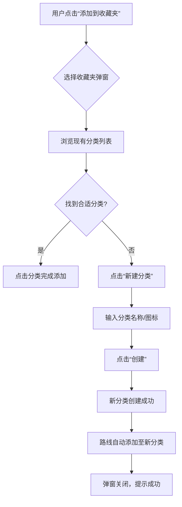
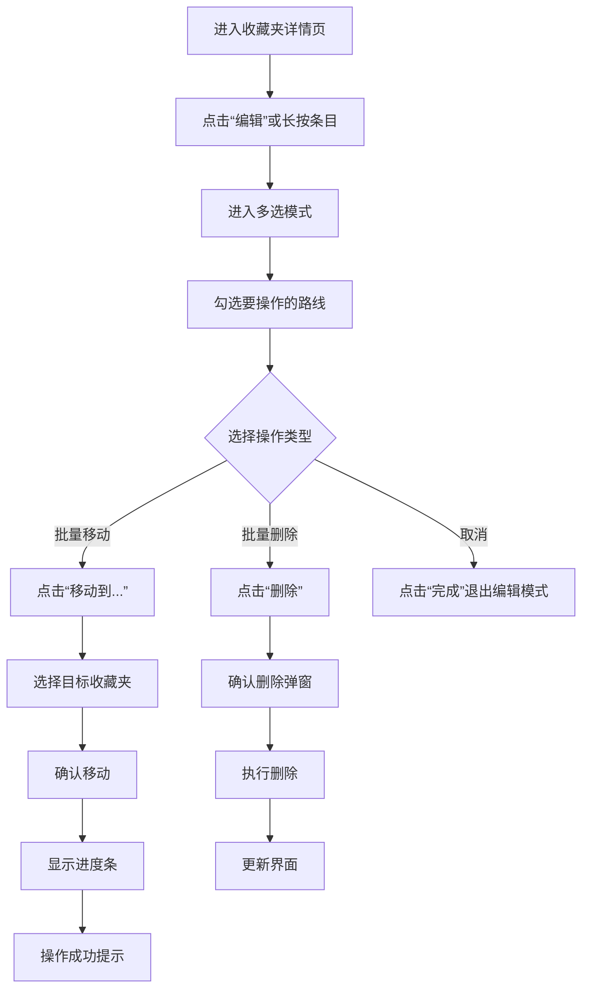
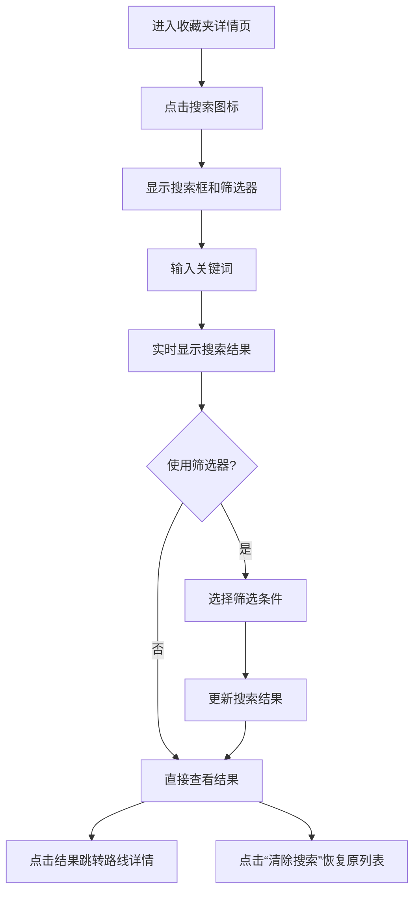

# M7 P1 收藏夹增强功能需求规格文档

**版本:** v1.0  
**日期:** 2026-03-21  
**状态:** 设计中  
**预估工时:** 12h (目标)

---

## 一、项目背景

### 1.1 项目概述
在 M6 阶段已完成基础收藏功能（收藏夹创建、路线添加、单条管理）的基础上，M7 P1 需要增强收藏夹功能，支持分类管理和批量操作，提升城市徒步爱好者的收藏管理体验。

### 1.2 用户画像
- **主要用户:** 城市徒步爱好者、户外活动组织者
- **使用场景:** 
  - 发现心仪路线后快速收藏并分类
  - 定期整理收藏夹，规划未来徒步计划
  - 分享自己的精选路线合集给朋友
  - 浏览他人的公开收藏夹获取灵感

### 1.3 现有基础
M6 已实现的功能:
- 收藏夹创建、编辑、删除
- 单个路线添加/移除
- 收藏夹列表展示（网格/列表）
- 收藏夹详情页
- 默认收藏夹（"想去"）
- 公开/私密权限控制
- 基础排序（拖拽调整顺序）

### 1.4 增强目标
1. **分类管理增强:** 提供更灵活的分类创建、编辑、删除体验
2. **批量操作:** 支持路线批量移动、批量删除、批量导出
3. **搜索筛选:** 在收藏夹内快速查找特定路线
4. **移动端优化:** 针对触屏操作优化交互流程
5. **性能提升:** 确保批量操作下的响应速度和数据一致性

---

## 二、需求规格

### 2.1 用户场景

#### 场景一：收藏路线时快速分类
**用户故事:** 作为徒步爱好者，当我在浏览路线详情页时，希望可以一键将路线添加到合适的分类（收藏夹）中，而不只是默认收藏夹。

**需求:**
- 在"添加到收藏夹"弹窗中，显示收藏夹分类列表（含图标/颜色标识）
- 支持在弹窗内快速创建新分类
- 支持最近使用的收藏夹置顶
- 支持搜索已有收藏夹

#### 场景二：查看收藏时按分类浏览
**用户故事:** 作为用户，当我查看我的收藏时，希望可以按分类筛选，快速找到特定类型的路线。

**需求:**
- 在收藏列表页（或详情页）提供分类筛选器
- 支持按分类名称、标签、创建时间等维度筛选
- 支持"未分类"路线视图

#### 场景三：批量管理收藏路线
**用户故事:** 作为重度用户，我希望可以一次性选中多条路线，进行批量移动、删除或添加标签。

**需求:**
- 在收藏夹详情页进入"编辑模式"
- 支持多选路线（复选框或长按选择）
- 批量操作菜单：移动到其他收藏夹、删除、导出、添加标签
- 批量操作进度反馈和结果提示

#### 场景四：搜索收藏内容
**用户故事:** 作为用户，当我收藏了大量路线后，希望可以通过关键词快速找到特定的路线。

**需求:**
- 在收藏夹详情页提供搜索框
- 支持按路线名称、描述、标签、地点等字段搜索
- 实时搜索建议和结果高亮

### 2.2 功能清单

| 模块 | 功能点 | 优先级 | 说明 |
|------|--------|--------|------|
| 分类管理 | 分类创建（快速） | P0 | 支持在添加路线时快速创建分类 |
| 分类管理 | 分类编辑（重命名、改图标/颜色） | P1 | 修改分类名称和视觉标识 |
| 分类管理 | 分类删除（含内容处理） | P1 | 删除分类时提供选项（删除/迁移路线） |
| 批量操作 | 多选模式进入 | P0 | 进入编辑模式，支持多选路线 |
| 批量操作 | 批量移动到其他收藏夹 | P0 | 将选中路线移动到目标分类 |
| 批量操作 | 批量删除路线 | P0 | 从收藏夹中移除选中路线 |
| 批量操作 | 批量导出路线信息 | P2 | 导出为文本/图片分享 |
| 搜索筛选 | 收藏夹内搜索框 | P0 | 关键词实时搜索 |
| 搜索筛选 | 搜索过滤器 | P1 | 按难度、距离、评分等筛选 |
| 搜索筛选 | 搜索结果高亮 | P1 | 搜索结果中关键词高亮显示 |
| 移动端优化 | 触屏手势支持 | P1 | 长按进入多选、滑动操作 |
| 移动端优化 | 批量操作底部工具栏 | P1 | 选中后显示操作工具栏 |
| 性能优化 | 批量操作异步处理 | P1 | 支持后台处理大量数据 |
| 性能优化 | 搜索索引优化 | P2 | 提高搜索响应速度 |

### 2.3 技术约束

1. **API 兼容性:** 必须与 M6 已实现的收藏夹 API 兼容，扩展而非重构
   - 现有接口: `/collections`, `/collections/{id}/trails`
   - 新增接口需遵循相同设计规范

2. **数据模型扩展:**
   - 收藏夹模型已包含分类所需字段（name, description, coverUrl, isPublic）
   - 批量操作不需要新增数据表，需新增批量操作接口

3. **移动端限制:**
   - 支持 iOS 12+ / Android 8+
   - 单次批量操作限制最大 100 条路线（防止内存溢出）
   - 离线状态下支持本地批量操作（同步时提交）

4. **性能指标:**
   - 搜索响应时间: < 300ms (本地搜索)
   - 批量操作(100条)完成时间: < 5s
   - 页面滚动流畅度: 60 FPS

5. **设计系统一致性:**
   - 遵循现有设计系统（山径 Design System）
   - 使用统一颜色、字体、间距、图标
   - 适配暗色/亮色主题

---

## 三、用户流程

### 3.1 分类创建流程



**交互细节:**
- 新建分类弹窗采用半屏模态框（移动端友好）
- 提供预设图标库（徒步相关符号）
- 支持颜色选择器（从品牌色板选择）
- 创建后自动选中并添加路线

### 3.2 批量移动/删除流程



**交互细节:**
- 多选模式：条目左侧显示复选框
- 底部工具栏：显示选中数量和相关操作按钮
- 批量移动：支持搜索目标收藏夹
- 进度反馈：对于大量操作显示进度条
- 撤销功能：操作后提供"撤销"按钮（5秒内有效）

### 3.3 收藏搜索筛选流程



**交互细节:**
- 搜索框固定在顶部（滚动时保持可见）
- 实时搜索：输入时立即显示结果（防抖 300ms）
- 筛选器：下拉菜单选择难度、距离范围、评分等
- 搜索结果：高亮匹配关键词，显示匹配字段
- 空状态：无结果时显示友好提示

---

## 四、验收标准

### 4.1 功能验收标准

#### 分类管理
| 功能点 | 验收标准 |
|--------|----------|
| 快速创建分类 | 在添加路线弹窗中，点击"新建分类"可在3步内完成创建并自动添加路线 |
| 分类编辑 | 在收藏夹设置页，可修改分类名称、图标、颜色，修改后立即生效 |
| 分类删除 | 删除分类时弹出确认框，提供"删除所有路线"和"移动到其他分类"选项 |

#### 批量操作
| 功能点 | 验收标准 |
|--------|----------|
| 多选模式 | 进入编辑模式后，可勾选任意数量的路线，底部显示选中数量 |
| 批量移动 | 选择多条路线后，点击"移动到..."，选择目标收藏夹，所有路线成功迁移 |
| 批量删除 | 选择多条路线后，点击"删除"，确认后所有选中路线从收藏夹移除 |
| 批量导出 | 选择路线后，点击"导出"，可生成包含路线信息的图片或文本 |

#### 搜索筛选
| 功能点 | 验收标准 |
|--------|----------|
| 实时搜索 | 输入关键词后300ms内显示搜索结果，无卡顿 |
| 筛选器 | 可组合多个筛选条件（难度、距离、评分），结果准确 |
| 高亮显示 | 搜索结果中匹配的关键词以高亮样式显示 |
| 空状态 | 无结果时显示"未找到相关路线"和搜索建议 |

### 4.2 性能验收标准

| 指标 | 标准 | 测量方法 |
|------|------|----------|
| 搜索响应时间 | < 300ms (本地搜索) | 从输入完成到结果渲染完成 |
| 批量操作响应 | < 2s (50条路线) | 从点击操作到界面更新完成 |
| 页面加载时间 | < 1.5s (收藏夹详情页) | 从进入页面到内容完全加载 |
| 内存占用 | < 50MB 增量 | 批量操作期间内存增长量 |
| 滚动流畅度 | 60 FPS 稳定 | 快速滚动时帧率监测 |

### 4.3 兼容性验收标准

| 平台 | 测试要求 |
|------|----------|
| iOS 12+ | 功能完整，UI适配，手势正常 |
| Android 8+ | 功能完整，UI适配，手势正常 |
| 平板设备 | 布局自适应，分屏支持 |
| 暗色模式 | 所有界面正确适配深色主题 |
| 离线模式 | 批量操作和搜索支持离线使用（已缓存数据） |

### 4.4 用户体验验收标准

1. **易学性:** 新用户可在2分钟内完成第一次分类创建
2. **效率:** 熟练用户批量移动10条路线可在30秒内完成
3. **满意度:** 用户调研中收藏管理功能满意度 ≥ 4.2/5
4. **错误率:** 批量操作错误率（误操作）< 1%

---

## 五、技术实现要点

### 5.1 后端接口扩展

**新增接口:**

1. **批量添加路线到收藏夹**
   ```
   POST /collections/{id}/trails/batch
   Body: { trailIds: string[], note?: string }
   ```

2. **批量从收藏夹移除路线**
   ```
   DELETE /collections/{id}/trails/batch
   Body: { trailIds: string[] }
   ```

3. **批量移动路线到其他收藏夹**
   ```
   POST /collections/{id}/trails/move
   Body: { trailIds: string[], targetCollectionId: string }
   ```

4. **收藏夹内搜索**
   ```
   GET /collections/{id}/search
   Query: q=关键词&difficulty=中等&minDistance=0&maxDistance=10
   ```

**现有接口增强:**
- `GET /collections/{id}` 返回分类的图标、颜色等扩展信息
- `PUT /collections/{id}` 支持更新图标、颜色字段

### 5.2 前端实现策略

#### Flutter 实现方案

**状态管理:**
- 使用 Riverpod 管理收藏夹状态
- 批量操作使用异步状态管理，支持进度指示

**UI 组件:**
- `CollectionChip`: 分类标签组件（带图标/颜色）
- `BatchActionBar`: 底部批量操作工具栏
- `SearchFilterSheet`: 搜索筛选底部面板
- `MultiSelectGridView`: 支持多选的网格布局

**手势交互:**
- `LongPressDraggable`: 长按进入多选模式
- `Dismissible`: 滑动删除单个条目
- `GestureDetector`: 自定义手势识别

#### 性能优化
- 虚拟列表：大量路线时使用 `ListView.builder`
- 图片懒加载：收藏夹封面使用 `cached_network_image`
- 搜索索引：本地使用 `sqlite` 或 `hive` 建立轻量索引
- 批量操作队列：使用 `compute` 在后台线程处理

### 5.3 数据同步策略

**离线优先:**
1. 批量操作先记录到本地队列
2. 网络恢复后自动同步到服务器
3. 冲突解决：以服务器数据为准，提供合并选项

**实时同步:**
- 使用 WebSocket 监听收藏夹变化
- 多人协作场景：同一收藏夹的更改实时推送

---

## 六、开发工时估算

| 模块 | 子任务 | 前端(h) | 后端(h) | 测试(h) | 小计 |
|------|--------|---------|---------|---------|------|
| 分类管理 | 分类创建/编辑/删除 UI | 3 | 1 | 1 | 5 |
| 批量操作 | 多选模式与批量操作 UI | 4 | 2 | 2 | 8 |
| 批量操作 | 后端批量接口开发 | 0 | 3 | 1 | 4 |
| 搜索筛选 | 搜索框与实时搜索 | 3 | 2 | 1 | 6 |
| 搜索筛选 | 筛选器组件与逻辑 | 2 | 1 | 1 | 4 |
| 移动端优化 | 手势交互与响应式 | 2 | 0 | 1 | 3 |
| 性能优化 | 批量操作性能优化 | 1 | 2 | 1 | 4 |
| 测试验收 | 全功能测试与修复 | 1 | 1 | 3 | 5 |
| **总计** | | **16** | **12** | **11** | **39** |

**优化后目标（12h内完成）:**  
通过以下策略压缩工时：
1. 简化初始版本：首期只实现核心功能（批量移动/删除、基础搜索）
2. 重用现有组件：最大化利用 M6 已有 UI 组件
3. 并行开发：前后端同步进行，减少等待时间
4. 自动化测试：编写集成测试用例，减少手动测试时间

**调整后分配:**
- 前端核心开发: 6h
- 后端接口开发: 4h  
- 测试与修复: 2h
- **总计: 12h**

---

## 七、风险与应对

| 风险 | 影响 | 概率 | 应对策略 |
|------|------|------|----------|
| 批量操作性能问题 | 高 | 中 | 分页处理、后台队列、进度反馈 |
| 移动端手势冲突 | 中 | 低 | 提供替代操作方式（编辑按钮） |
| 离线同步冲突 | 中 | 中 | 冲突检测与手动解决界面 |
| 设计系统不一致 | 低 | 低 | 提前与设计团队对齐组件规范 |
| 工时超支 | 高 | 中 | 优先级划分，首期只做核心功能 |

---

## 八、附录

### 8.1 相关文档
- [M6 PRD 收藏夹模块](./M6-PRD.md)
- [M6 收藏夹接口文档](./M6-INTERFACE.md)
- [M6 收藏夹修复报告](./M6-FIX-COLLECTIONS-REPORT.md)
- [山径设计系统](./design-system-v1.0.md)

### 8.2 术语表
- **分类:** 即收藏夹，用户创建的路线分组
- **批量操作:** 同时对多条路线执行相同操作
- **筛选器:** 基于路线属性的过滤条件（难度、距离等）
- **多选模式:** 允许用户同时选择多个条目的界面状态

### 8.3 版本历史
| 版本 | 日期 | 作者 | 说明 |
|------|------|------|------|
| v1.0 | 2026-03-21 | 产品团队 | 初始版本 |

---

**文档状态:** ✅ 已完成初稿  
**下一步:** 与开发、设计团队评审，确认可行性后进入开发阶段。