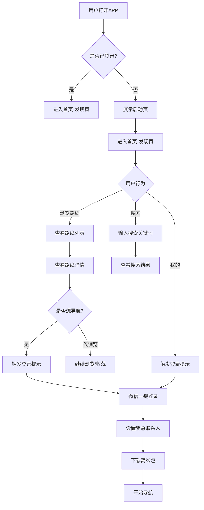
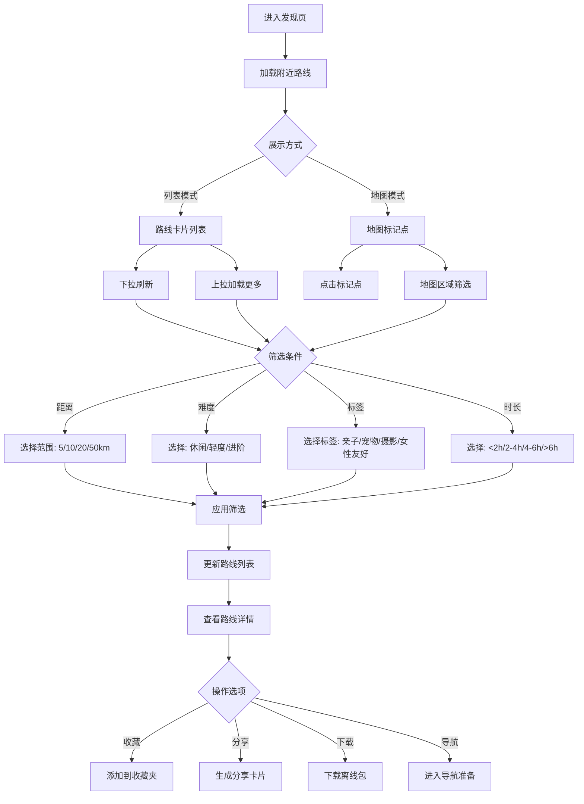
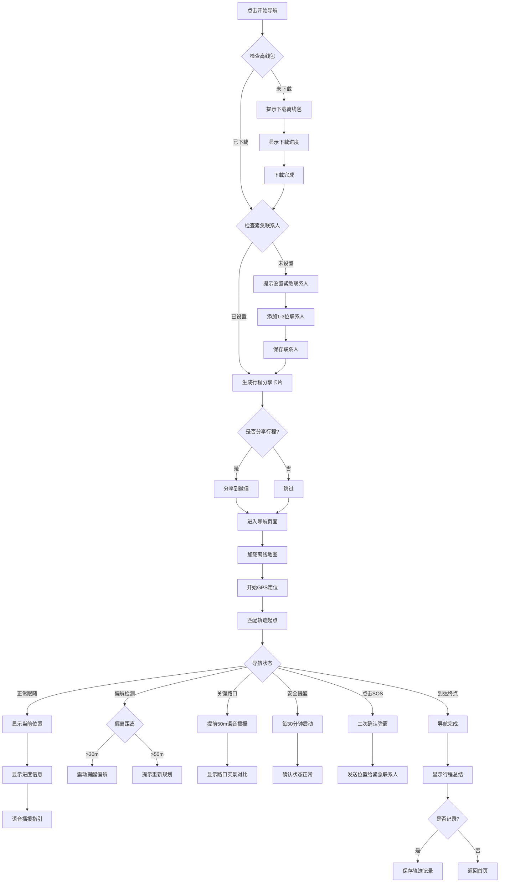
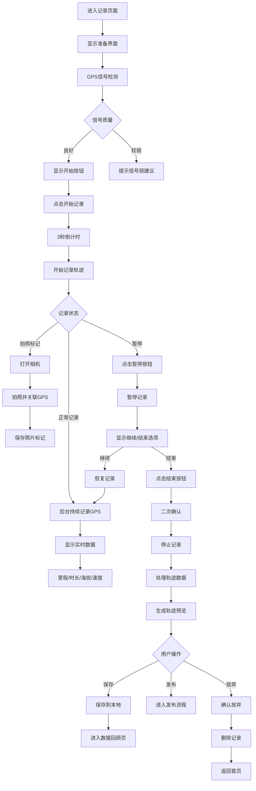
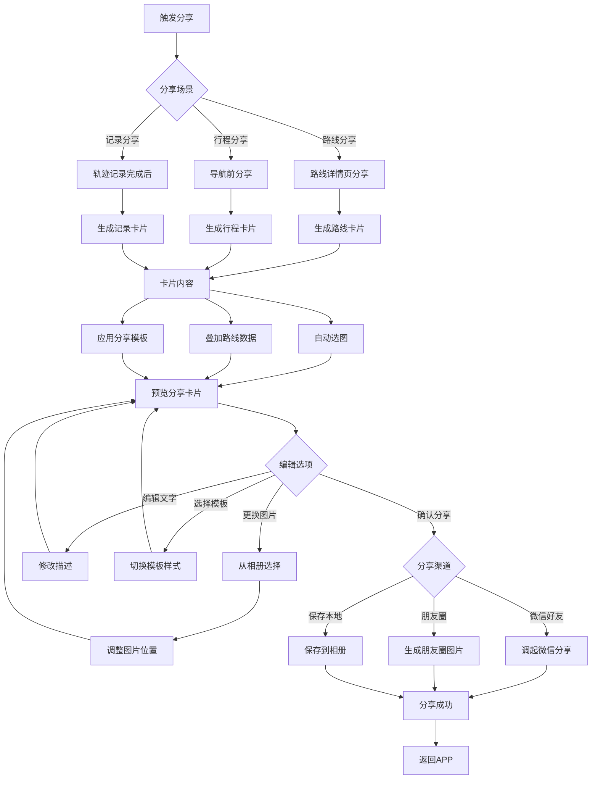
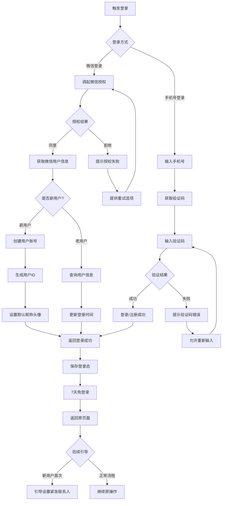

# 山径APP - 用户流程图设计文档

> **文档版本**: v1.0  
> **制定日期**: 2026-02-27  
> **文档状态**: 设计阶段  
> **适用范围**: Week 2 产品设计阶段

---

## 1. 用户流程图总览

### 1.1 流程图设计原则

基于PRD v1.2中定义的产品定位（城市年轻人的轻度徒步向导），用户流程设计遵循以下原则：

| 原则 | 说明 | 体现 |
|------|------|------|
| **极简路径** | 核心功能3步可达 | 发现→下载→导航 |
| **安全第一** | 安全功能前置提醒 | 导航前检查紧急联系人 |
| **离线优先** | 弱网/无网场景友好 | 离线包下载流程优化 |
| **零门槛** | 新用户无需注册即可浏览 | 游客模式支持 |

---

## 2. 核心用户流程图（Mermaid）

### 2.1 新用户首次使用流程

**流程说明**:
1. **游客模式**: 新用户无需登录即可浏览路线、查看详情
2. **登录触发点**: 仅在需要个性化功能（导航、收藏、设置）时触发登录
3. **首次导航强制流程**: 登录→设置紧急联系人→下载离线包→开始导航

---

### 2.2 路线发现流程

**流程说明**:
1. **双模式切换**: 列表模式适合快速浏览，地图模式适合空间感知
2. **多维筛选**: 距离、难度、标签、时长四个维度交叉筛选
3. **筛选记忆**: 用户偏好筛选条件本地缓存，下次自动应用

---

### 2.3 路线导航流程

**流程说明**:
1. **前置检查**: 离线包和紧急联系人是导航开始的必要条件
2. **行程分享**: 导航前生成分享卡片，让亲友知晓行程
3. **多层偏航处理**: 30m提醒，50m重新规划，避免频繁打断
4. **定时安全确认**: 每30分钟震动提醒，用户需确认状态

---

### 2.4 轨迹记录流程

**流程说明**:
1. **信号预检**: 开始前检测GPS信号质量，给用户预期
2. **后台保活**: 锁屏、切换应用时持续记录
3. **照片标记**: 拍照自动关联GPS坐标，形成"脚印"
4. **异常保护**: 异常退出自动保存已记录部分

---

### 2.5 分享流程

**流程说明**:
1. **一键生成**: 自动选图+数据叠加+模板应用，降低创作门槛
2. **三种场景**: 路线分享（发现好路线）、行程分享（安全告知）、记录分享（成就展示）
3. **模板选择**: 提供多种风格模板（简约/户外/文艺）

---

### 2.6 用户注册/登录流程

**流程说明**:
1. **微信优先**: 主推微信一键登录，降低门槛
2. **手机号备选**: 提供手机号登录作为备选方案
3. **新用户识别**: 自动识别新老用户，新用户引导设置紧急联系人
4. **登录态持久**: 7天免登录，减少重复登录打扰

---

## 3. 用户流程详细说明

### 3.1 流程决策点汇总

| 决策点 | 场景 | 默认选项 | 说明 |
|--------|------|----------|------|
| 登录触发 | 需要个性化功能时 | 游客模式 | 浏览功能无需登录 |
| 离线包下载 | 首次导航前 | 自动下载 | 可手动取消，但会提示风险 |
| 紧急联系人 | 首次导航前 | 强制设置 | 至少1位，最多3位 |
| 行程分享 | 导航开始前 | 推荐分享 | 可跳过，但会提示安全建议 |
| 偏航处理 | 偏离路线时 | 自动提醒 | 30m震动提醒，50m重新规划 |

### 3.2 异常流程处理

| 异常场景 | 处理方式 | 用户提示 |
|----------|----------|----------|
| 网络中断 | 使用缓存数据，提示离线模式 | "当前处于离线模式，部分功能受限" |
| GPS信号弱 | 提示信号弱，建议开阔地带 | "GPS信号较弱，请前往开阔地带" |
| 离线包损坏 | 提示重新下载 | "离线包损坏，请重新下载" |
| 存储空间不足 | 提示清理空间 | "存储空间不足，请清理后重试" |
| 电量低(<20%) | 提示省电模式 | "电量较低，已开启省电模式" |

### 3.3 关键路径时长预估

| 路径 | 步骤数 | 预估时长 | 优化目标 |
|------|--------|----------|----------|
| 发现→开始导航 | 5步 | <2分钟 | 减少下载等待 |
| 登录→设置紧急联系人 | 3步 | <1分钟 | 简化表单填写 |
| 开始记录→保存 | 3步 | 用户决定 | 后台自动处理 |
| 生成分享图→分享 | 2步 | <30秒 | 一键生成优化 |

---

## 4. 流程图与PRD对应关系

| 流程图 | PRD用户故事 | 验收标准关联 |
|--------|-------------|--------------|
| 新用户首次使用流程 | US-001, US-008 | 首页显示、微信登录 |
| 路线发现流程 | US-001, US-002 | 路线列表、路线详情 |
| 路线导航流程 | US-003, US-004, US-006, US-007 | 离线包、导航、SOS、分享 |
| 轨迹记录流程 | US-101 | 轨迹记录、照片标记 |
| 分享流程 | US-007, US-102 | 行程分享、一键生成分享图 |
| 用户注册/登录流程 | US-008 | 微信登录、登录状态持久化 |

---

## 5. 附录

### 5.1 流程图符号说明

| 符号 | 含义 | 使用场景 |
|------|------|----------|
| 矩形 | 操作/处理 | 用户操作或系统处理 |
| 菱形 | 判断/决策 | 条件分支 |
| 圆角矩形 | 开始/结束 | 流程起点和终点 |
| 平行四边形 | 输入/输出 | 数据输入或输出 |
| 箭头 | 流程方向 | 流程走向 |

### 5.2 更新日志

| 版本 | 日期 | 更新内容 |
|------|------|----------|
| v1.0 | 2026-02-27 | 初版完成，包含6个核心流程图 |

---

> **"安全第一，体验第二，功能第三"** - 每个流程设计都需优先考虑用户安全
